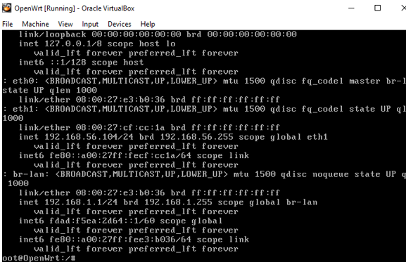

# Network Setup

## OpenWRT Environment

OpenWRT was installed using VirtualBox to simulate a secure small business network.

### Two adapters were configured:
Adapter 1: NAT

### Provides internet access.
Adapter 2: Host-only Adapter

Provides secure communication between host and OpenWRT.

---

## IP Configuration

### LAN : 192.168.1.1
### WAN : 192.168.56.103
### Commands:
##### ip addr
##### ip route

---

## Connectivity Testing

### Commands:
#### ping 8.8.8.8
#### ping google.com
The tests confirmed communication between host and OpenWRT.

---

## Network Components

#### Internet → OpenWRT Router → Switch → Server + Staff PCs + Printer
---

## Evidence
#### - ip addr
The following is a screenshot of output of ip addr:

- ping tests
- VirtualBox adapters
- OpenWRT terminal
